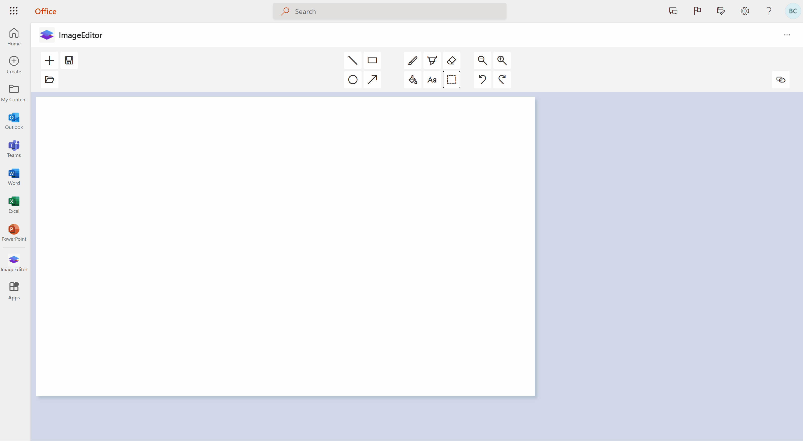

# Image Editor

Image Editor is a web app that runs on the Office 365 platform on multiple host apps (Teams, Office, Outlook). The app allows users to edit, save, open, and save images, using Microsoft Graph API. 

Use this project as a template to create your own web app that can be used in all three Microsoft host apps.

## Development

### Clone repository

`git clone https://github.com/OfficeDev/m365-extensibility-image-editor.git`

Run all commands from the root of m365-extensibility-image-editor

### Prerequisites

Node.js
<https://nodejs.org/en/>

Yarn
<https://yarnpkg.com/getting-started/install>

### Install

run `yarn install`

### Build and run

To run on localhost using webpack devserver:

`yarn start`

Dev server will run on <https://localhost:8080> by default.
  
Ignore and skip unsafe localhost (no localhost cert) in the browser for development.
Alternatively use your own cert and domain name.

### Registering the app and setting up sign in

In order to get sign in with MSAL working for the Image Editor app (to get Microsoft Graph API functioning), you have to do these essential steps:
  
1. **Create test tenant**
For creating a test tenant see <https://docs.microsoft.com/en-us/office/developer-program/microsoft-365-developer-program-get-started>

2. **Register the app as an enterprise application**

    - Get credentials for the admin of your test tenant
    - Go to <https://portal.azure.com/#blade/Microsoft_AAD_RegisteredApps/ApplicationsListBlade>
    - Click '+ New registration'.
    - Enter a custom name for your App
    - **Supported account types** - Accounts in any organizational directory (Any Azure AD directory - Multitenant)
    - **Redirect URI** - Field1: "Single-page application (SPA)" Field2 (host src): "https://localhost:8080/"
    - Click Register

3. **Changing app configs**

    - We need to set the new application id into the configs of the app code.
    - If have not done so, clone this repository.
    - Go to <https://portal.azure.com/#blade/Microsoft_AAD_RegisteredApps/ApplicationsListBlade> to see all of your app registrations
    - Click on the 'All applications'
    - Click on the entry of your **App Registration** made in step 2.
    - Take note of the application id from the overview tab of the app registration, this value should be a guid
    - Go back to the root of the image editor repository
    - in '.env.dev' file, change APP_ID field to the application id you obtained above.
    - in '.env.prod' file, change APP_ID field to the application id you obtained above.

4. **Applying admin approvals**
    - We need to, as an admin, give consent to the app to access the tenant's resources and services.
    - Go to the base of the repo and run `yarn start` to start the Image Editor app.
    - Attempt to sign in with the admin credentials for the tenant you created.
    - Permision Requested: As the admin, check the 'Consent on behalf of your organization' and click Accept. (another dialog to request the same consent may show up).
    - Now on the App you should see an error: 'Loading error: Error in loadDataStore, innerError: Error in mountDefaultPod, innerError: Unable to retrieve user's OneDrive domain.' You have to grant permission to Onedrive (through the graph api). To do this...
    - Go to <https://portal.azure.com/#blade/Microsoft_AAD_IAM/StartboardApplicationsMenuBlade/Overview> and see that there is a new entry for the Image Editor App.
    - Click on 'All Applications' on the side bar.
    - In the list, Click on the Image Editor app with the name you've assigned it.
    - Click on Permissions.
    - Click on 'Grant Admin Consent'
    - **Permissions requested Review for your organization** : Click accept. (The dialog might be frozen on 'redirect', just exit it).
    - Refresh the previous page, you should see an entry for 'Graph API' that was granted.
    - Go back to the 'Image Editor App', refresh, and try to login again.
    - A few more consents may be needed to be granted. As the admin, check the 'Consent on behalf of your organization' and click Accept for all of them.
    - You may need to refresh and login again to find it has succeeded.
    - Now you can sign in to the Image Editor app.

### Running across Microsoft 365 (Office.com, Outlook, and Teams)

Within Microsoft Teams, a user can upload a 'manifest file' (json config file) that is then read by the other Microsoft host apps (Outlook, Office), to host the Image Editor app within their experiences - giving the user access to the app in all three locations. This manifest will have information on your registered app id, website url, and more. The following instructions is for a dev testing, localhost, manifest.
  
1. run `yarn start`, ensure app is running on localhost:8080
2. edit manifest file **configs\hosts\manifest.json** so the id property value matches the app registration you set up above.
3. Set a list of valid domains under 'validDomains', which accepts an array with type string
4. zip all files in the **configs\hosts** folder (do not zip the folder itself, just the contents)
5. go to <https://dev.teams.microsoft.com/apps> and click **Import App** to upload the .zip file.
6. go to the new app's entry, click **preview app**, and 
teams has loaded, click add.
  

  
By default the app will only show up in your teams application. To enable a multi-hub experience, you will need to meet certain prerequisites as described in this article: <https://docs.microsoft.com/en-us/microsoftteams/platform/m365-apps/prerequisites>
  
Please note that after enrolling your developer tenant for Office 365 Targeted releases, it may take upwards of 5 days for your tenant to be part of the release. After that, you will be able to see your app in outlook and office.
  
**Access app on Teams**  
<https://www.teams.com>  

  
**Access app on Office**  
<https://www.office.com/>  

  
**Access app on Outlook**  
<https://www.outlook.com/>  

For more information on extending your app across Microsoft 365:  
<https://docs.microsoft.com/en-us/microsoftteams/platform/m365-apps/overview>
  
For more information on the app manifest:  
<https://docs.microsoft.com/en-us/microsoftteams/platform/resources/schema/manifest-schema-dev-preview>
  
For more information on the app SDK:  
<https://docs.microsoft.com/en-us/javascript/api/overview/msteams-client?view=msteams-client-js-latest>
  
### Build production

Building minified production files  
`yarn build:prod`  
minified files placed in dist folder

### Tests

To run jest tests  
`yarn test`

### Linting

To run linting  
`yarn lint`  
To run linting and automatically fix issues  
`yarn lint:fix`

## Contributing

This project welcomes contributions and suggestions. Most contributions require you to agree to a
Contributor License Agreement (CLA) declaring that you have the right to, and actually do, grant us
the rights to use your contribution. For details, visit <https://cla.opensource.microsoft.com>.

When you submit a pull request, a CLA bot will automatically determine whether you need to provide
a CLA and decorate the PR appropriately (e.g., status check, comment). Simply follow the instructions
provided by the bot. You will only need to do this once across all repos using our CLA.

This project has adopted the [Microsoft Open Source Code of Conduct](https://opensource.microsoft.com/codeofconduct/).
For more information see the [Code of Conduct FAQ](https://opensource.microsoft.com/codeofconduct/faq/) or
contact [opencode@microsoft.com](mailto:opencode@microsoft.com) with any additional questions or comments.

## Trademarks

This project may contain trademarks or logos for projects, products, or services. Authorized use of Microsoft
trademarks or logos is subject to and must follow
[Microsoft's Trademark & Brand Guidelines](https://www.microsoft.com/en-us/legal/intellectualproperty/trademarks/usage/general).
Use of Microsoft trademarks or logos in modified versions of this project must not cause confusion or imply Microsoft sponsorship.
Any use of third-party trademarks or logos are subject to those third-party's policies.
